<!-- PROFILE HEADER -->

  

  <picture>
    <!-- Dark mode -->
    <source media="(prefers-color-scheme: dark)" srcset="https://readme-typing-svg.demolab.com?font=Fira+Code&size=22&pause=1100&color=FFFFFF&center=true&vCenter=true&width=800&lines=Self-taught+Software+Engineer;Everything+that+can+be+automated%2C+must+be+automated;AI+Research+%26+Applied+Automation;TypeScript%20%E2%80%A2%20Python%20%E2%80%A2%20AWS%20%E2%80%A2%20Elasticsearch"/>
    <!-- Light mode -->
    <source media="(prefers-color-scheme: light)" srcset="https://readme-typing-svg.demolab.com?font=Fira+Code&size=22&pause=1100&color=1F1C2C&center=true&vCenter=true&width=800&lines=Self-taught+Software+Engineer;Everything+that+can+be+automated%2C+must+be+automated;AI+Research+%26+Applied+Automation;TypeScript%20%E2%80%A2%20Python%20%E2%80%A2%20AWS%20%E2%80%A2%20Elasticsearch"/>
    <!-- Fallback (for renderers that don't support <picture>) -->
    
  </picture>

  <b>💻 Self-taught Software Engineer · Automation Fanatic · AI Enthusiast</b> 
  <i>"Everything that can be automated, must be automated."</i>

<!-- Quick links -->

  
  
  

## 🧑🏻‍💻 About

I'm a **Software Engineer based in Singapore** with a strong interest in automation, backend engineering, system design, and practical applications of AI.
- ⚙️ I enjoy building systems that automate repetitive work and reduce operational complexity.
- 🤖 I explore practical applications of **AI, LLMs and AI-assisted software engineering**.
- 🏗️ I'm interested in **backend architecture, distributed systems, automation and scalable systems**.
- 🧩 I like solving problems by simplifying processes rather than adding unnecessary complexity.
- 🌍  I'm based in 
- 🌐 Check out my [**Personal Website**](https://www.terencekong.net)  
- 🤝  I'm looking to collaborate on Interesting projects
- ⚡  Feel free to reach out via [**LinkedIn**](https://www.linkedin.com/in/terence-kong) or [**Leave a message**](https://github.com/reshinto/reshinto/issues/new?title=Guestbook%20entry&labels=guestbook&body=Write%20your%20message%20here%20%E2%9C%8C%EF%B8%8F)

## 🎯 Current Focus
I'm currently exploring and building around:
- 🤖 **Large Language Models & AI Engineering**
- 🧠 **AI-assisted software development**
- ⚙️ **Workflow and process automation**
- 🏗️ **Backend and distributed systems**
- ☁️ **Cloud-native architecture**
- 🔎 **Search and data-intensive applications**

## 🤖 AI & Automation
I'm particularly interested in using AI as an **engineering tool rather than simply a chatbot**.
Areas I'm exploring include:
- AI-assisted software engineering
- LLM agents and tool use
- Developer productivity automation
- Automated research and analysis
- Workflow orchestration
- AI-assisted testing and code review
- Retrieval-augmented generation
- Structured prompting and context engineering
- Human-in-the-loop automation

## 🧰 Tech Stack

### 🧠 Languages

  <picture><source media="(prefers-color-scheme: dark)" srcset="https://skillicons.dev/icons?i=html&theme=dark"/></picture>
  <picture><source media="(prefers-color-scheme: dark)" srcset="https://skillicons.dev/icons?i=css&theme=dark"/></picture>
  <picture><source media="(prefers-color-scheme: dark)" srcset="https://skillicons.dev/icons?i=js&theme=dark"/></picture>
  <picture><source media="(prefers-color-scheme: dark)" srcset="https://skillicons.dev/icons?i=ts&theme=dark"/></picture>
  <picture><source media="(prefers-color-scheme: dark)" srcset="https://skillicons.dev/icons?i=nodejs&theme=dark"/></picture>
  <picture><source media="(prefers-color-scheme: dark)" srcset="https://skillicons.dev/icons?i=py&theme=dark"/></picture>
  <picture><source media="(prefers-color-scheme: dark)" srcset="https://skillicons.dev/icons?i=java&theme=dark"/></picture>
  <picture><source media="(prefers-color-scheme: dark)" srcset="https://skillicons.dev/icons?i=cs&theme=dark"/></picture>
  <picture><source media="(prefers-color-scheme: dark)" srcset="https://skillicons.dev/icons?i=cpp&theme=dark"/></picture>
  <picture><source media="(prefers-color-scheme: dark)" srcset="https://skillicons.dev/icons?i=c&theme=dark"/></picture>
  <picture><source media="(prefers-color-scheme: dark)" srcset="https://skillicons.dev/icons?i=ruby&theme=dark"/></picture>
  <picture><source media="(prefers-color-scheme: dark)" srcset="https://skillicons.dev/icons?i=md&theme=dark"/></picture>

### ⚙️ Tools

  <picture><source media="(prefers-color-scheme: dark)" srcset="https://skillicons.dev/icons?i=bash&theme=dark"/></picture>
  <picture><source media="(prefers-color-scheme: dark)" srcset="https://skillicons.dev/icons?i=git&theme=dark"/></picture>
  <picture><source media="(prefers-color-scheme: dark)" srcset="https://skillicons.dev/icons?i=github&theme=dark"/></picture>
  <picture><source media="(prefers-color-scheme: dark)" srcset="https://skillicons.dev/icons?i=gitlab&theme=dark"/></picture>
  <picture><source media="(prefers-color-scheme: dark)" srcset="https://skillicons.dev/icons?i=bitbucket&theme=dark"/></picture>
  <picture><source media="(prefers-color-scheme: dark)" srcset="https://skillicons.dev/icons?i=sass&theme=dark"/></picture>
  <picture><source media="(prefers-color-scheme: dark)" srcset="https://skillicons.dev/icons?i=bootstrap&theme=dark"/></picture>
  <picture><source media="(prefers-color-scheme: dark)" srcset="https://skillicons.dev/icons?i=jenkins&theme=dark"/></picture>
  <picture><source media="(prefers-color-scheme: dark)" srcset="https://skillicons.dev/icons?i=vim&theme=dark"/></picture>
  <picture><source media="(prefers-color-scheme: dark)" srcset="https://skillicons.dev/icons?i=vscode&theme=dark"/></picture>
  <picture><source media="(prefers-color-scheme: dark)" srcset="https://skillicons.dev/icons?i=react&theme=dark"/></picture>
  <picture><source media="(prefers-color-scheme: dark)" srcset="https://skillicons.dev/icons?i=angular&theme=dark"/></picture>
  <picture><source media="(prefers-color-scheme: dark)" srcset="https://skillicons.dev/icons?i=express&theme=dark"/></picture>
  <picture><source media="(prefers-color-scheme: dark)" srcset="https://skillicons.dev/icons?i=flask&theme=dark"/></picture>
  <picture><source media="(prefers-color-scheme: dark)" srcset="https://skillicons.dev/icons?i=django&theme=dark"/></picture>
  <picture><source media="(prefers-color-scheme: dark)" srcset="https://skillicons.dev/icons?i=fastapi&theme=dark"/></picture>
  <picture><source media="(prefers-color-scheme: dark)" srcset="https://skillicons.dev/icons?i=rails&theme=dark"/></picture>
  <picture><source media="(prefers-color-scheme: dark)" srcset="https://skillicons.dev/icons?i=npm&theme=dark"/></picture>
  <picture><source media="(prefers-color-scheme: dark)" srcset="https://skillicons.dev/icons?i=yarn&theme=dark"/></picture>
  <picture><source media="(prefers-color-scheme: dark)" srcset="https://skillicons.dev/icons?i=docker&theme=dark"/></picture>
  <picture><source media="(prefers-color-scheme: dark)" srcset="https://skillicons.dev/icons?i=anaconda&theme=dark"/></picture>
  <picture><source media="(prefers-color-scheme: dark)" srcset="https://skillicons.dev/icons?i=elasticsearch&theme=dark"/></picture>

  <!-- Badges for unsupported icons -->
  
  
  
  

### ☁️ Cloud & Databases

  <picture><source media="(prefers-color-scheme: dark)" srcset="https://skillicons.dev/icons?i=postgres&theme=dark"/></picture>
  <picture><source media="(prefers-color-scheme: dark)" srcset="https://skillicons.dev/icons?i=mysql&theme=dark"/></picture>
  <picture><source media="(prefers-color-scheme: dark)" srcset="https://skillicons.dev/icons?i=mongodb&theme=dark"/></picture>
  <picture><source media="(prefers-color-scheme: dark)" srcset="https://skillicons.dev/icons?i=firebase&theme=dark"/></picture>
  <picture><source media="(prefers-color-scheme: dark)" srcset="https://skillicons.dev/icons?i=heroku&theme=dark"/></picture>
  <picture><source media="(prefers-color-scheme: dark)" srcset="https://skillicons.dev/icons?i=aws&theme=dark"/></picture>
  
  

### 💻 Operating Systems

  <picture><source media="(prefers-color-scheme: dark)" srcset="https://skillicons.dev/icons?i=apple&theme=dark"/></picture>
  <picture><source media="(prefers-color-scheme: dark)" srcset="https://skillicons.dev/icons?i=linux&theme=dark"/></picture>
  <picture><source media="(prefers-color-scheme: dark)" srcset="https://skillicons.dev/icons?i=windows&theme=dark"/></picture>
  <picture><source media="(prefers-color-scheme: dark)" srcset="https://skillicons.dev/icons?i=ubuntu&theme=dark"/></picture>

## 🤝 Collaboration
I'm interested in projects involving:
- AI and LLM applications
- Developer tools
- Automation
- Backend systems
- Distributed systems
- Cloud infrastructure
- Productivity tooling
If you have an interesting project or idea, feel free to reach out through [LinkedIn](https://www.linkedin.com/in/terence-kong).

## 📊 GitHub Activity

  

  

## [☕ Support me on Ko-fi](https://ko-fi.com/terencekong28304)
If you find my projects, research, experiments or open-source work useful, you can support my work on Ko-fi.
Support is completely optional, but always appreciated.
